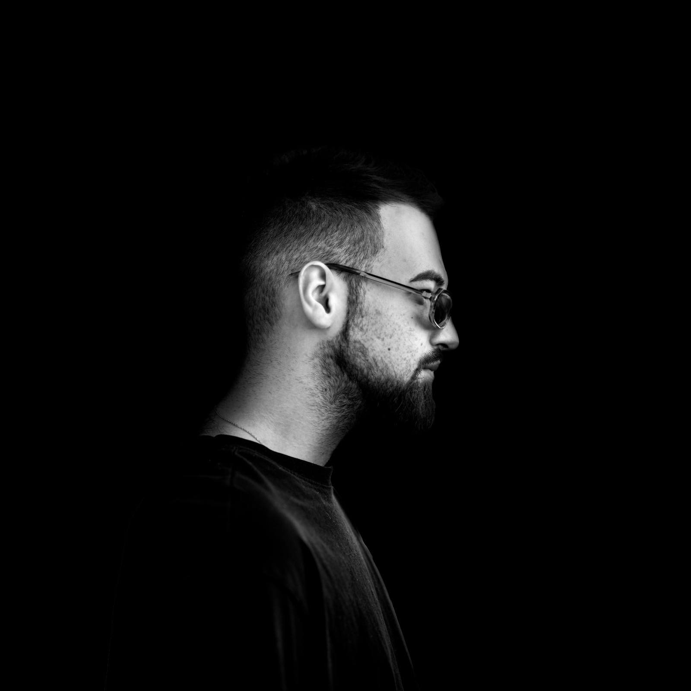
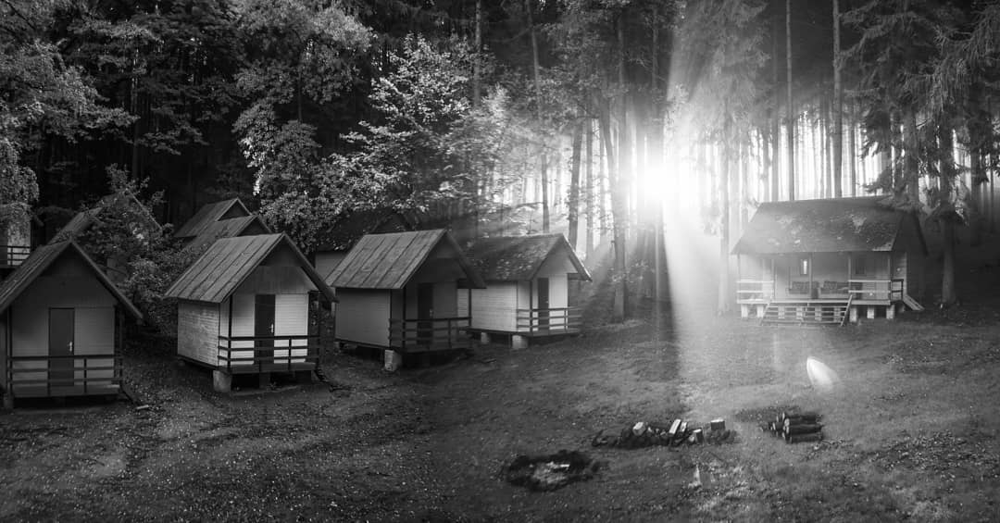
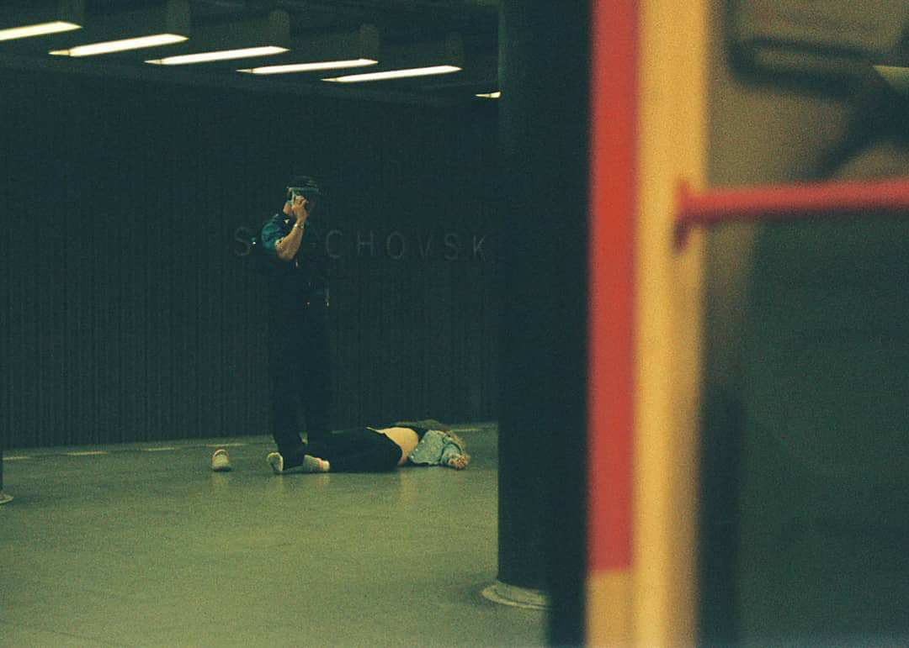

# Adam Baranowski
Photograpger, graphic designer, 3D artist and web designer based in Prague, Czech Republic 

## Photography
### I specialize in analog and digital studio photography. Photography was the first medium I've ever tried working with.

Back in high school, I stumbled upon the captivating world of analog photography, and it was like discovering a hidden treasure. There's something magical about the process of developing film, the anticipation of seeing your shots come to life in a darkroom – it's an art form in itself.

Fast forward to today, and while I've fully embraced the convenience and flexibility of digital photography, my heart still holds a special place for that nostalgic analog feel.

The challenge for me now is to bridge the gap between the two worlds – capturing the essence of analog in a digital setting. It's all about finding that perfect blend where the warmth and character of traditional photography meet the precision and innovation of the digital age.

**It's a journey of experimentation, learning, and a whole lot of passion for freezing moments in time.**

## Development
### Self-taught programmer and full-stack developer

## Music
### My favourite type of active rest

## 3D
### Combining my passion for design, photography and code
